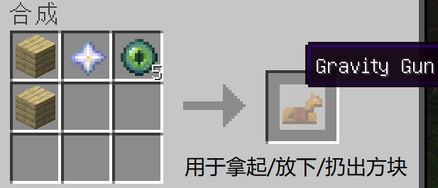
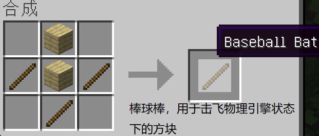

# Senki MCJava

<figure><figcaption>
Welcome to the Minecraft Service
</figcaption></figure>

### MOD生存服

服务端版本1.19.4-FabricAPI版本0.83.0-Fabric Loader版本0.14.21

种子：-1541124385142397106

地址：frp.senki.top

端口：25565

服务器模组：

1. youritemsaresafe（落地成盒）
2. vanilla-refresh（功能增强）
3. Physics Toys（物理引擎）
4. PlayerHealthIndicators（头顶显示生命值）
5. Phosphor（优化模组，优化照明引擎来节省cpu并提高性能）
6. Our Villager Discounts（共享村民的交易折扣）
7. diggusmaximus（连锁挖矿）（需要客户端端同时安装）
8. Lithium（优化模组，改善原版机制的计算方法）
9. Hopo Better Ruined Portals（优化模组，使传送门遗迹和下界更壮观）
10. Furnacerecycle（回收利用，将废品炼制成原材料）
11. Fullstackwatchdog（腐竹用来诊断崩溃的）
12. Essential Commands（常用的简单命令）
13. Cryingportals（重制哭泣黑曜石，使其能用来搭建传送门）
14. Chunksending（优化模组，优化了服务端区块数据包的分发逻辑）
15. Beautified Chat（美化聊天）
16. AdditionalStructures（失落废墟，随机生成小建筑）

服务器前置模组：

1. FabricAPI
2. Rayon（物理引擎核心）
3. kotlin（一种语言）
4. collective（Lib 类模组）

客户端版本1.19.4-Fabric版本0.83.0- Fabric Loader版本0.14.21

客户端模组：

1. diggusmaximus（连锁挖矿）（需要服务端同时安装）
2. sodium（优化模组，优化fps）

客户端前置模组：

1. FabricAPI

Winodws客户端下载地址\[HMCL]：[https://mc.senki.top/Senki-JavaMC-khd.zip](https://mc.senki.top/Senki-JavaMC-khd.zip)

更新记录：

23/06/08---修复了玩家皮肤显示问题

服务器特性：

1. 死亡后生成墓碑：可以防止物品丢失。为了游戏的平衡性，背包需要提前有以下材料：盔甲架：1个原木 或 3个木板 | 箱子：2个原木、8个木板 或 1个箱子。
2. 玩家坐下：双手槽位为空时，玩家可面朝地，蹲下+右键点击以坐下，坐下时默认朝向正前方。
3. 生命值显示：准心指向其他生物时，生物的生命值将显示在快捷栏上方。
4. 可装备旗帜：头部槽位为空时，玩家手持旗帜并三击蹲键可将旗帜戴在头上。
5. 自动回归的经验球：杀了很远的怪物？那些球会自己回来。
6. 更忠诚的三叉戟：三叉戟不小心掉下虚空了？现在它会毫不犹豫得朝你飞回来。
7. 更好的盔甲架：现在盔甲架默认有手臂。如果玩家在旁边放下拉杆，就能控制它的姿势，多数姿势都是从基岩版移植的。
8. 唱片机循环播放：唱片机里插入的光盘将自动循环播放，因此玩家不必大费周章地来回更换。
9. 悬挂梯子：按下潜行键放置梯子，可以让它在空中继续延伸，悬挂在半空中。
10. 自定义方块动画：改进了包括附魔台、酿造台、信标、凋灵骷髅头骨、龙蛋和唱片机在内的方块动画。
11. 死亡音效：在玩家死亡时向全服所有玩家播放音效。可以根据死亡方式播放不同的声音，或直接设置声音。
12. 虚空图腾：手持/副手持图腾坠入虚空时，玩家将进入一种漂浮模式，直到抵达地面。
13. 凋灵掉头：击败凋灵后，它的头会掉下来作为奖杯，可用来作为胜利的展示。
14. 重大事件字幕：召唤凋灵等重大事件将在屏幕上显示戏剧性的标题。
15. 生物群系字幕：探索全新的生物群系时，会将名称/类别名称显示为字幕。
16. 日期计数器：计算服务器度过的天数，每天开始时都显示。
17. 作物经验：当破坏农作物如小麦、南瓜、下界疣时，玩家有机会获得一些经验。
18. 低生命值声音：如果玩家在低生命值时受到伤害，将播放心跳声。
19. 更好的磁石：在磁石上放一张命名的纸为它命名，也可以用染料更改文本的颜色。在磁石顶部丢弃一颗末影珍珠将创建一个即时路标，玩家距此 96 个方块以内，使用末影珍珠将瞬间传送过来。
20. 选项卡显示：允许玩家列表上（tab键列表）显示统计信息。
21. Belowname：玩家名称下方将显示统计数据，或是循环其所有统计数据
22. 路径冲刺：路径现在可以提供速度加成。
23. 提示：每 10 分钟发送一条聊天消息，消息内容是可能有用的 Minecraft 知识。
24. 盔甲架和框架隐形：在盔甲架或物品框架上投掷隐形药水使其隐形，使用喷溅的水瓶使其重新出现！
25. 追溯坐标：使追溯指针显示玩家死亡的坐标和尺寸
26. 可读时钟：拿着时钟将显示玩家所处的日期和时间。如果不想一直拿在手上，也可以把它放在物品展示框上查看时间。
27. 派对蛋糕：让蛋糕更加令人惊讶！在蛋糕上放烟花，吃的时候会有五彩纸屑爆炸特效（并不悲伤）。
28. 加入/退出音效：当有玩家加入或退出游戏时，播放通知音效。
29. 更好的小僵尸：将小僵尸的生命值减半，但它们更兴奋了（会跑还会跳，跑得更快了）。
30. 铁砧反切石：不小心做了好多个深板岩石砖楼梯？在上面放一个铁砧，能让它转换回深板岩圆石。这适用于许多其他方块，如蓝冰、石砖和剥皮原木。
31. 回响碎片静音：将回响碎片丢在生物身上以使其静音。玩家可以通过杀死生物、在生物上方放水来取回碎片。
32. 旁观者幽灵：为处于旁观者模式的玩家提供非旁观者玩家可见的白色效果粒子。
33. 旁观者动作：进入旁观者模式时，玩家将获得UI动作，单击这些动作可以观看随机玩家或退出旁观者模式。
34. 时间偏移：你知道《我的世界》日期是如何奇怪地从第 0 天开始的吗？本模组为日期增加了 1 天，所以当玩家第一次创造世界时，就在第1天！在现有世界中，世界将增加 1 天。
35. 物理引擎：添加了一些物品，让您可以使用“真实”物理的力量移动和摧毁东西！
36. 头顶生命值：您可以观察到其它玩家的实时生命值，它和第一人称的生命材质包同步！
37. 照明引擎优化：节省 CPU 并以此提高性能，游戏生成区块所用时间会减半，生成世界所用时间也将大幅降低
38. 交易折扣：所有玩家共享村民的交易折扣
39. 连锁挖矿：按住\~键并挖掘可连锁挖掉矿物/树木
40. 算法优化：改善原版机制的计算方法：物理，怪物AI，世界生成，区块加载，刷怪塔，方块tick，爆炸，生物行为，数据跟踪器。
41. 遗迹优化：废弃传送门结构的种类丰富且更壮观，同时也增加了下界的壮观建筑
42. 回收利用：添加了一些烧炼配方，可以变废为宝，使用熔炉来回收一些物品/方块的材料了。为了游戏平衡，回收所带来的材料会较少。
43. 快捷指令：添加了一些简单的命令，例如/tpa
44. 哭泣的黑曜石：黑曜石也可以搭建传送门了，可以和普通黑曜石混用
45. 分发逻辑：一次性发送大量区块时，使其分散到多个Tick中进行，因此能降低网络压力，减少瞬时掉刻（Lag Spike），改善网络不佳时的游戏体验。
46. 美化聊天：更改聊天消息的样式和颜色
47. 失落废墟：添加了约155个新的小建筑来丰富Minecraft世界

服务器特有的新结构：

1. 沿途倒伏的树木
2. 坍塌的远古石像
3. 隐藏在树林深处的破旧小木屋
4. 废旧的露天营地
5. 破败的小农场
6. 远古战士的残破坟墓
7. 奇怪的小神庙

服务器新增指令：

1. 玩家间tp

/tpa <目标玩家> 请求传送到xxx玩家

/tpahere <目标玩家> 请求玩家传送到你这儿

/tpaccept <目标玩家> 接受传送请求

/tpdeny <目标玩家> 拒绝传送请求

1. 与家相关 (/home)

/home set <名称> 设置家

/home list 显示所有已保存位置的家

/home tp <名称> 传送至家（注：如果只设置了一个家，可以不写家的名称这个参数）

/home delete <名称> 删除家

1. 地标相关 (/warp)

/warp set <名称> 设置个新的地标

/warp list 显示所有已保存位置的家

/warp tp <名称> 传送至某地标（注：不同于家的指令，即使只设置了一个家，名称的参数仍需填写）

/warp delete <名称> 删除某地标

1. /spawn类

/spawn set 设置传送点

/spawn \[tp] 传送至设置的传送点（"tp"字段可省略）

\#spawn只能设置一个

1. /back 返回传送前的位置
2. /rtp 或 /randomteleport 传送至随机位置
3. /workbench 打开工作台（类似于随身工作台）
4. /enderchest 打开自己的末影箱

服务器新增工作台配方：

1. 物理引擎

  .png>) 
