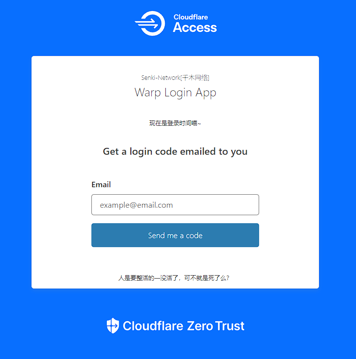

# \[维护]WARP NET

> 这个章节将展示“WARP NET”的有关信息


注意：本章节不可避免的会有反审查色彩。



声明：千木社对大陆审查制度保持中立态度，拒绝评价。


## 致谢：

<figure><figcaption>
感谢Cloudflare提供的成熟解决方案
</figcaption></figure>

> 只需按一下按钮，用户就可以通过附近的 Cloudflare 数据中心使用 WireGuard 隧道将他们的移动设备连接到整个互联网。Cloudflare 背后站点的流量变得更快，用户在互联网其余部分的体验变得更加安全和私密。                                                                   ——Cloudflare WARP

## 描述：

如[致谢](warp-net.md#zhi-xie)所说的那样，Cloudflare WARP可以让用户的互联网体验变得更加安全和私密

## 特点：

1. 使用全球最快的DNS\[1.1.1.1]作为解析地址，并使用DNS-over-HTTPS 或 DNS-over-TLS加密用户DNS请求。
2. 设备的所有流量都使用 WARP 加密并私下发送到最近的 WARP 端点。这可以保护用户免受任何人的窥探。
3. 多节点分布，能够更快的连接到CF数据中心并降低延迟。
4. 无视审查，用户可以使用WARP自由绕过所在地区防火墙访问被屏蔽的内容。
5. 隐匿IP属地，使服务商不能了解到真实的IP地址。 \[IP属地将会变成CLOUDFLARE.COM]
6. 不限速，最大速度取决于运营商和服务商。
7. 原生IP，服务商风控几率小。

## 提示：

尽管其带有明显的科学上网色彩，但其仍旧不是科学上网工具，因为其无法帮助你绕过锁区，仅仅是无视审查制度而已。

## 连接：

\*新手请看教程

请通过“快速支持页”按照提示获得信息（推荐）

或者通过下方链接直达（不推荐，链接有失效风险）


直达


## 使用教程：

首先需要准备以下工具：

> 1.一台可联网设备
>
> 2.一个受支持的邮箱
>
> 3.手，脑
>
> 4.（可选）梯子，最好是香港的

#### 下载客户端

CF WARP客户端多平台支持


下载


以 [Windows](warp-net.md#yi-windows-wei-li) | [Android](warp-net.md#yi-android-wei-li) 为例，苹果设备操作类似，Linux用户请自行探索。

#### **以 Windows 为例**

1.打开客户端界面，单击齿轮，打开偏好设置。

<figure><figcaption></figcaption></figure>

2.依次单击账户——使用 Cloudflare Zero Trust 登录

<figure><figcaption></figcaption></figure>

3.输入通过“快速支持页”按照提示获得的团队名称。

<figure><figcaption></figcaption></figure>

4.输入合规的邮箱地址

<figure><figcaption></figcaption></figure>

5.输入邮箱中的验证码

<figure><figcaption></figcaption></figure>

6.单击Open Cloudflare WARP

<figure><figcaption></figcaption></figure>

7.此时logo变为Zero Trust

<figure><figcaption></figcaption></figure>


提示：如果登录时出现问题或超时，可以挂梯子解决，仅需挂一次，除非重装客户端/系统，否则无需登录第二次。



Tip：如果对分配到的节点不满意，可以挂一个离大陆近的梯子\[比如香港的]重连来刷新“主机托管中心”，但一般来说降低的那一丁点延迟和丢包率可有可无。


#### **以** Android **为例**

1.打开客户端，单击右上角三横杠。

<figure><figcaption></figcaption></figure>

2.单击账户

<figure><figcaption></figcaption></figure>

3.单击登录到 Cloudflare Zero Trust

<figure><figcaption></figcaption></figure>

4.输入输入通过“快速支持页”按照提示获得的团队名称

<figure><figcaption></figcaption></figure>

5.输入合规的邮箱地址

<figure><figcaption></figcaption></figure>

6.输入验证码

<figure><figcaption></figcaption></figure>

7.单击Open Cloudflare WARP

<figure><figcaption></figcaption></figure>

8.此时logo变为Zero Trust

<figure><figcaption></figcaption></figure>


提示：如果登录时出现问题或超时，可以挂魔法解决，仅需挂一次，除非重装客户端/系统，否则无需登录第二次。



Tip：如果对分配到的节点不满意，可以挂一个离大陆近的梯子\[比如香港的]重连来刷新“主机托管中心”，但一般来说降低的那一丁点延迟和丢包率可有可无。

