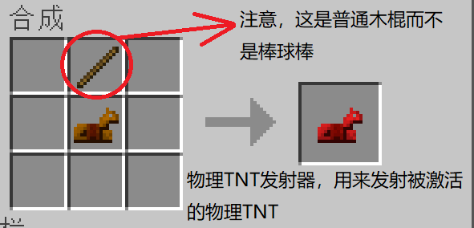

# \[维护]Senki MCJava

<figure><figcaption>
Welcome to the Minecraft Service
</figcaption></figure>

> 这个章节将展示“Senki MCJava”的有关信息

## 描述：

和熟人玩的服，正好用Senki托管，嘎嘎方便。虽然是私服，但实际上谁进来都可以。

## 公告：

\*大部分已迁移至“[注意事项](wei-hu-senki-mcjava.md#zhu-yi-shi-xiang)”

## 内容：

### A00\[MOD生存服]1/1

#### 服务器信息：

服务端版本:1.19.4

FabricAPI版本:0.83.0

Fabric Loader版本:0.14.21

地址：frp.senki.top

端口：25565

兼容性：Only Java

强制正版登录：否

开始使用：[客户端支持](wei-hu-senki-mcjava.md#ke-hu-duan-zhi-chi)

注意事项：[注意事项](wei-hu-senki-mcjava.md#zhu-yi-shi-xiang)

#### 服务器模组：

1. 早点睡\[<mark style="color:blue;">Sleep Sooner</mark>]**\[双端]**
2. 现代化性能修复\[ModernFix]**\[双端可选]**
3. 流畅加载\[Smooth Boot]**\[双端可选]**
4. 玉\[Jade]**\[双端可选]**
5. Xaero的小地图\[Xaero's Minimap]**\[双端服可选]**
6. Xaero的世界地图\[Xaero's World Map]**\[双端服可选]**
7. 自动启停\[Tick Stasis]
8. 氪\[Krypton]**\[双端可选]**
9. 铁氧体磁芯\[FerriteCore]**\[双端可选]**
10. 连锁挖掘\[Diggus Maximus]**\[双端]**
11. 聊天美化\[<mark style="color:blue;">Beautified Chat</mark>]
12. 物品保护\[<mark style="color:blue;">Your Items Are Safe</mark>]**\[双端客可选]**
13. 不哭泣的黑曜石\[<mark style="color:blue;">Crying Portals</mark>]**\[双端客可选]**
14. 失落废墟 \[Additional Structures]
15. 物理道具\[<mark style="color:purple;">Physics Toys</mark>]**\[双端客可选]**
16. 锂\[Lithium]**\[双端可选]**
17. 磷\[Phosphor]**\[双端客可选]**
18. 简单指令\[Essential Commands]
19. \#这是腐竹用来诊断崩溃滴\[FullStack Watchdog]
20. 壮观的传送门遗迹\[Hopo Better Ruined Portals]
21. 原版功能增强\[Vanilla Refresh]
22. 分发逻辑优化\[Chunk Sending]

#### 服务器前置模组：


默认不展示Fabric API，但确实需要这个前置mod，几乎所有mod都依赖它。


1. <mark style="color:blue;">Collective</mark>**\[双端]**
2. <mark style="color:purple;">Rayon</mark>**\[双端]**

#### 客户端模组：

1. Iris光影加载器\[<mark style="color:orange;">Iris Shaders</mark>]
2. 3D皮肤层\[Skin Layers 3D]
3. 更好的FPS\[Better Fps]
4. 更好的延迟显示\[Better Ping Display]
5. 聊天头像\[Chat Heads]
6. 连锁挖掘\[Diggus Maximus]**\[双端]**
7. 进食动画\[Eating Animation]
8. 铁氧体磁芯\[FerriteCore]**\[双端可选]**
9. 输入法冲突修复\[IMBlocker]
10. 一键背包整理Next\[<mark style="color:red;">Inventory Pro</mark><mark style="color:yellow;">files Next</mark>]
11. 边拿边走\[<mark style="color:green;">InvMove</mark>]
12. 玉\[Jade]**\[双端可选]**
13. 氪\[Krypton]**\[双端可选]**
14. 现代化性能修复\[ModernFix]**\[双端可选]**
15. Mod加载页\[Mod Loading Screen]
16. Mod菜单\[Mod Menu]
17. 极简血量显示\[Neat]
18. 流畅加载\[Smooth Boot]
19. 钠 · 扩展\[<mark style="color:orange;">Sodium Extra</mark>]
20. 状态效果读条\[Status Effect Bars]
21. 右下角字幕高亮\[<mark style="color:green;">Subtitle Highlight</mark>]
22. 穿草攻击\[SwingThrough]
23. <mark style="background-color:red;">皇冠猪\[Technopig]</mark>
24. 拾取放入动画\[Tiny Item Animations]
25. WI变焦\[WI Zoom]
26. Xaero的小地图\[Xaero's Minimap]**\[双端服可选]**
27. Xaero的世界地图\[Xaero's World Map]**\[双端服可选]**
28. 万用皮肤补丁\[CustomSkinLoader]

#### 客户端前置模组：


默认不展示Fabric API，但确实需要这个前置mod，几乎所有mod都依赖它。


1. 钠\[<mark style="color:orange;">Sodium</mark>]
2. <mark style="color:red;">Fabric Language Kotlin</mark>**\[双端可选]**
3. <mark style="color:yellow;">libIPN</mark>
4. <mark style="color:green;">Cloth Config API</mark>

## 更新记录：

23/06/16---重新添加了iris，允许玩家加载光影

23/06/16---添加了世界地图

23/06/16---筛了一遍模组，把无可厚非的模组清除

23/06/15---服务器崩溃，经排查发现了一个不友好模组，已删除

23/06/14---添加了一堆优化模组和功能性模组

23/06/14---在线更新上线，配合HMCL可实现自动化安装和更新

23/06/12---把<万能皮肤修复补丁>干掉了，它不适合HMCL用户

23/06/12---给客户端加了一堆优化模组

23/06/08---修复了玩家皮肤显示问题

23/06/08---双端搭建完毕

23/06/07---立项

## 特点：

### 特有功能


部分特有功能会随着用户私自修改客户端默认设置而失效


1. 性能优化：各个角度，一堆有效性能优化，这里不赘述。
2. 早睡觉：早大约半小时睡觉会有一条有趣的提示，但允许睡觉并修正时间。
3. 地图：提供左上角小地图和“M”键世界地图。
4. 自动启停：无人时服务器将自动暂停。
5. 连锁挖掘：允许连锁挖掘方块，挖掘时需要按住“\~”键。
6. 美化聊天：美化聊天界面，使其看起来更生动。
7. 物品保护：玩家死亡后原地生成一个墓，用来保护物品（前提是有至少3个原木或11木板等材料可供消耗）
8. 不哭泣的黑曜石：允许玩家使用哭泣的黑曜石搭建传送门，可以和普通黑曜石混搭。
9. 失落废墟：增加了一些小结构小建筑来丰富世界。
10. 物理引擎：添加了拥有物理引擎的道具。为了照顾性能，不会直接重写物理引擎，而是让物体短期内能模拟实体运动。道具合成请参考“[物理引擎道具合成](wei-hu-senki-mcjava.md#wu-li-yin-qing-dao-ju-he-cheng)”
11. 简单指令：具体请查看“[特有指令](wei-hu-senki-mcjava.md#te-you-zhi-ling)”
12. 壮观的传送门遗迹：地面的传送门种类更加丰富壮观，增加并美化下界建筑物。
13. 玩家坐姿：面朝下、潜行并右键单击，可以坐在任何地方（你的双手槽位必须是空的
14. 生物健康显示：在你的快捷栏上方显示你附近生物的健康状况
15. 可装备的旗帜：要装备旗帜，请在拿着旗帜的同时单击三次潜行（你的头部槽位必须是空的
16. 自动回归的经验球：从很远的地方杀死了怪物？那些球体会直接回到你身边
17. 额外忠诚的三叉戟：如果你的（忠诚）三叉戟掉入虚空，它会直接对准你弹回
18. 更好的盔甲架：它们现在有手臂，如果你在它们附近驱动一个杠杆，它会交换它们的姿势，其中一些姿势的灵感来自基岩版。姿势 2 和姿势 3 可用于将物品挂在墙上，使用隐形药水隐藏盔甲架。
19. 循环自动点唱机：自动点唱机中的光盘将循环播放，因此您不必每次想重新收听光盘时都重新插入它
20. 悬挂梯子：按下潜行键放置梯子，可以让它在空中继续延伸，悬挂在半空中。
21. 自定义方块动画：包括附魔台、酿造台、信标、凋灵骷髅头骨、龙蛋和点唱机在内的方块将改进方块动画
22. 死亡音效：在你死亡时向所有玩家播放全局音效。设置为根据您的死亡方式或设置的声音播放声音
23. 虚空图腾：手持/副手持图腾坠入虚空时，玩家将进入一种漂浮模式，直到抵达地面。
24. 凋灵掉头：击败凋灵后，它会掉下头作为战利品来炫耀你的胜利
25. 重大事件的字幕：召唤凋灵等重大行动将在屏幕上显示一个戏剧性的标题
26. 生物群系字幕：探索全新的生物群系时，会将名称/类别名称显示为字幕。
27. 日期计数器：计算服务器度过的天数，每天开始时都显示。
28. 作物经验：当破坏农作物如小麦、南瓜、下界疣时，玩家有机会获得一些经验。
29. 低健康声音：如果你在低健康状况下受到伤害，心跳声音将播放一次
30. 更好的磁石：- 将一张命名纸放在磁石上为其命名。也可以使用染料更改文本的颜色。将末影珍珠放在磁石上会创建一个即时传送点，可以通过末影珍珠将其传送到 96 格内。
31. 选项卡显示：允许玩家列表上（tab键列表）显示统计信息。
32. Belowname：玩家名称下方将显示统计数据，或是循环其所有统计数据
33. 路径冲刺： 路径现在可以给你速度，作为在你的城镇周围放置路径的激励
34. 提示：每 10 分钟发送一条聊天消息将可能有用的 minecraft 知识提示
35. 支架和框架隐形：将隐形药水扔在盔甲架或物品框架上使其隐形，使用喷水瓶使其重新出现
36. 恢复坐标：使恢复指南针显示您死亡的坐标和维度
37. 可读的时钟：拿着一个时钟会显示你所在的日期和时间。将它放在物品展示框上，无需手持即可查看时间。
38. 派对蛋糕：让你的蛋糕更令人惊讶，方法是在蛋糕上放一个烟花，让在吃的时候会有五彩纸屑爆炸（并不悲伤）
39. 加入/退出音效：当有人加入或退出游戏时播放通知音效
40. 更好的小僵尸：将小僵尸的健康减半，但让他们更兴奋（跳得更多，速度稍快）
41. 铁砧反切石：不小心做了好多个深板岩石砖楼梯？在上面放一个铁砧，能让它转换回深板岩圆石。这适用于许多其他方块，如蓝冰、石砖和剥皮原木。
42. 回响碎片静音：将回响碎片丢在生物身上以使其静音。玩家可以通过杀死生物、在生物上方放水来取回碎片。
43. 旁观者幽灵：为处于旁观者模式的玩家提供非旁观者玩家可见的白色效果粒子。
44. 旁观者动作：进入旁观者模式时，玩家将获得UI动作，单击这些动作可以观看随机玩家或退出旁观者模式。
45. 时间偏移：你知道《我的世界》日期是如何奇怪地从第 0 天开始的吗？本模组为日期增加了 1 天，所以当玩家第一次创造世界时，就在第1天！在现有世界中，世界将增加 1 天。
46. Iris光影：允许玩家加载Iris光影
47. 3D皮肤：用3D立体方式渲染皮肤第二层，看起来立体且充满质感
48. Ping值显示：玩家列表中会显示每个玩家的ping值
49. 聊天头像：玩家发送的信息前会显示皮肤头像。
50. 进食动画：吃东西时会有一点一点被吃掉的动画，使进食看起来不会那么的麻木。
51. 输入法优化：不输入文字时隐藏输入法，解决亚洲用户的困扰
52. 一键整理：位玩家提供一键整理背包/容器的快捷键
53. 边拿边走，在行走/疾跑时可以打开背包而不影响运动
54. 为玩家客户端添加一个Mod加载页面，让玩家知道加载慢并不是因为卡住了
55. 模组菜单：为高级玩家提供一个总菜单用来查看和调节mod，就不用去记那么多快捷键了。
56. 生物头顶显示血量：可以快速盘算生物生命值
57. 状态效果读条：以显示效果的剩余持续时间。
58. 右下角字幕高亮：显示不同颜色来分类
59. 右下角字幕彩蛋：啊你干嘛哎呦\~
60. 穿草攻击：允许玩家透过透明方块攻击后面的生物
61. <mark style="background-color:red;">皇冠猪：猪在被命名为 "Technoblade" 时头戴皇冠，以此悼念 Technoblade 的逝世。“愿天堂有吃不完的土豆，你说是吧，亲爱的Technoblade。”</mark>
62. 拾取放入动画：使用鼠标在槽间拾取或放入物品时添加了一些动画。
63. 视角缩放：使用“V”键配合滚轮可激活高达50倍的变焦缩放。

### 特有指令：

#### 1.玩家间tp

/tpa <目标玩家> 请求传送到xxx玩家

/tpahere <目标玩家> 请求玩家传送到你这儿

/tpaccept <目标玩家> 接受传送请求

/tpdeny <目标玩家> 拒绝传送请求

#### 2.与家相关 (/home)

/home set <名称> 设置家

/home list 显示所有已保存位置的家

/home tp <名称> 传送至家（注：如果只设置了一个家，可以不写家的名称这个参数）

/home delete <名称> 删除家

#### 3.地标相关 (/warp)

/warp set <名称> 设置个新的地标

/warp list 显示所有已保存位置的家

/warp tp <名称> 传送至某地标（注：不同于家的指令，即使只设置了一个家，名称的参数仍需填写）

/warp delete <名称> 删除某地标

#### 4./spawn类

/spawn set 设置传送点

/spawn \[tp] 传送至设置的传送点（"tp"字段可省略）

\#spawn只能设置一个

#### 5./back 返回传送前的位置

#### 6./rtp 或 /randomteleport 传送至随机位置

#### 7./workbench 打开工作台（类似于随身工作台）

#### 8./enderchest 打开自己的末影箱

### 物理引擎道具合成

  .png>) 

## 客户端支持：


仅对Windows端进行了最大程度的优化适配



全自动部署/更新仅与HMCL进行联动，其它启动器暂不支持


1. [下载HMCL](https://hmcl.huangyuhui.net/download/)
2. 打开HMCL
3. [设置好皮肤](wei-hu-senki-mcjava.md#1.-pi-fu-wen-ti)（除非你不在意皮肤问题
4. 单击左侧“版本列表”
5. 单击“安装整合包”
6. 选择“从互联网下载整合包”
7. 输入链接：[https://mc.senki.top/server-manifest.json](https://mc.senki.top/server-manifest.json)
8. 单击安装，等待安装完成
9. 此后每次启动客户端都会检查更新，无需二次安装


为了避免不必要的麻烦，请不要随意删改添加Mod，除非你很懂。


## 注意事项：

### 1.皮肤问题：

正版和离线用户不出意外都会发现自己和其它人的皮肤不正常，因为没有被正确配置。(除非你不注重皮肤

本服使用“[MC统一认证平台](http://cqjzd.immersionh.cn/)”作为皮肤站

1. 注册并登录“[MC统一认证平台](http://cqjzd.immersionh.cn/)”
2. 进入“我的衣柜”，设置皮肤和披风
3. 进入“角色管理”，检查或修改角色名（客户端的离线用户名称应该和角色名保持一致）

### 2.联不通？移不动？

连不上服务器请[私信](../../)我（我没开服，省电

## 快速支持：


直达


